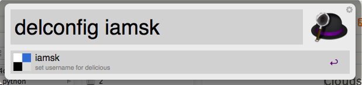
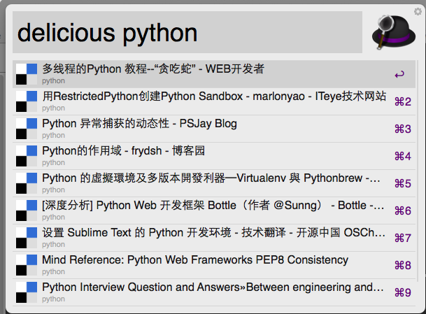

alfred4delicious
================

alfred for get bookmarks from delicious.com

## 安装

从
https://github.com/iamsk/alfred4delicious/raw/master/delicious.alfredworkflow
下载，安装即可

## 用法

### 设置用户账号

### 查询最近收藏的网页

### 根据标签查询最近收藏的网页

